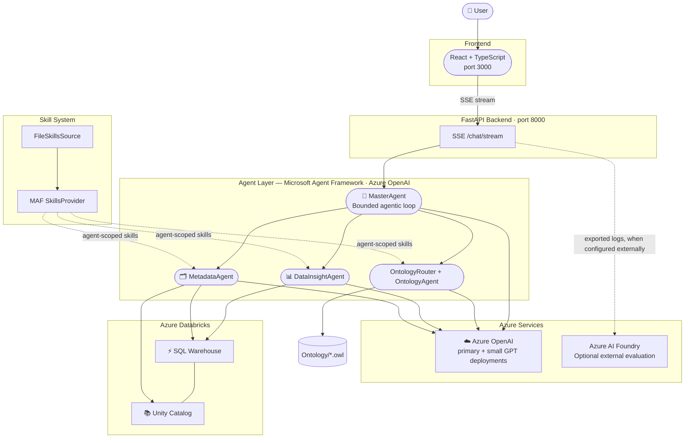

# Ontology Data Agent

An intelligent, enterprise-grade data analytics system powered by Azure OpenAI, Microsoft Agent Framework (MAF), an OWL business ontology, and Azure Databricks. Designed for business-language analytical questions over governed Unity Catalog data.

## 🌟 Features

### Core Capabilities
- **Multi-Agent Architecture**: MasterAgent orchestrates three specialized agents — OntologyAgent, MetadataAgent, and DataInsightAgent — each with domain-specific tools
- **MasterAgent Agentic Loop**: One bounded MAF function loop repeats model → Agent/tool → observation until the model emits a final answer without another tool call
- **Skill System**: Native MAF `SkillsProvider` advertises agent-scoped skills and loads full instructions or indexed resources on demand
- **Data Insight**: DataInsightAgent executes read-only natural-language-to-SQL queries against an Azure Databricks SQL Warehouse
- **Metadata Browsing and Recall**: MetadataAgent uses Unity Catalog table summaries for deterministic candidate recall, batch-fetches candidate details, and retains UC tools for model-driven gap recovery
- **Skill- and Ontology-Guided Analytics**: OntologyRouter checks governed Skills; ordinary enabled requests use deterministic, question-driven OWL evidence, UC physical verification, and a dynamically loaded planning Skill so the primary model derives SQL at runtime
- **Session-Scoped Ontology Mode**: Each chat session independently enables or disables ontology enrichment; failures are shown in the thinking panel and fall back to the standard metadata-driven workflow
- **User-Authored Business Layer**: Business users edit a workspace semantic document in the UI (terminology, metric definitions, reporting rules); it is stored under `data/`, injected into every analytical request, takes effect without a restart, and complements the OWL ontology in both ontology modes
- **Multi-turn Conversations**: Context-aware dialogue with MAF in-memory thread store; each browser session gets an isolated thread
- **Concurrent Sessions**: Each thread has independent messages, loading state, MAF history, cancellation, and can run alongside other threads
- **Stop & Session Cache**: Stop cancels only the active thread; exact repeated questions can reuse a completed answer from the same session without external calls
- **Streaming SSE Responses**: FastAPI streams `thinking`, `text`, `answer_reset`, `thinking_done`, `stopped`, `done`, and `error`

### Technology Stack
- **LLM routing**: Primary Azure OpenAI deployment for Master, Ontology routing/recovery, and DataInsight; `AZURE_OPENAI_GPT_SMALL_DEPLOYMENT` for Metadata discovery/verification
- **Agent Framework**: Microsoft Agent Framework 1.11 — `OpenAIChatCompletionClient`
- **Primary Frontend**: React + TypeScript (Vite, port 3000)
- **Backend API**: FastAPI with Server-Sent Events (port 8000)
- **Data Analytics**: Azure Databricks Unity Catalog plus SQL Warehouse through the Databricks SQL connector
- **Ontology Runtime**: Owlready2 with read-only recursive OWL loading; optional HermiT reasoning is disabled by default
- **Observability**: Structured activity streaming and rotating application logs, suitable for external evaluation pipelines
- **Agent Skills**: Extend the agent’s capabilities using agent skills, enabling the agent to analyze data based on real-world business rules.
- **Unified Data Platform**: Combines verified physical metadata with an existing OWL business ontology while preserving their separate authority boundaries.

## 🏗️ Architecture



## 📁 Project Structure

```
Data-Insight-Agent-With-Ontology/
├── src/
│   ├── agents/
│   │   ├── master_agent.py      # Orchestration agent; tools: delegate_metadata,
│   │   │                        #   delegate_data_analysis
│   │   ├── data_insight_agent.py# Databricks SQL; execute_sql + bounded
│   │   │                        #   context recovery; governed + dynamic planning Skills
│   │   ├── metadata_agent.py    # Unity Catalog schema; tools: list_schemas,
│   │                            #   list_tables, get_table_details, search_tables;
│   │                            #   native Skill: metadata-mapping
│   │   ├── ontology_agent.py    # Owlready2 semantic entity/property/path tools
│   │   └── maf_runtime.py       # MAF 1.11 client/session/stream adapter
│   ├── ontology/
│   │   └── service.py            # Read-only OWL loading, indexing, and graph queries
│   ├── metadata_catalog.py       # Unity Catalog SDK access, object cache,
│   │                            #   candidate detail batch fetch, SQL identifier checks
│   ├── query_engine.py          # Request-scoped MasterAgent observations
│   │                            #   and streaming context
│   ├── api/
│   │   └── main.py              # FastAPI server: SSE /chat/stream + REST endpoints
│   ├── prompts/                 # Per-agent system prompts:
│   │   └── master.py · ontology.py · data_insight.py · metadata.py
│   ├── config/
│   │   └── settings.py          # AzureOpenAIConfig, AzureAIFoundryConfig,
│   │                            #   DatabricksConfig, OntologyConfig, AppConfig
│   ├── skills_provider.py       # Agent-scoped native MAF SkillsProvider factory
│   ├── business_layer.py        # Workspace business semantic document store (data/)
│   └── utils/
│       └── logger.py            # Logging utilities
├── skills/
│   ├── analytics-spec/          # Skill: data analytics query patterns
│   │   ├── SKILL.md             # Intent routing + resource index
│   │   └── references/
│   │       └── highest-spending-customer.sql
│   ├── sql-planning/   # Skill: dynamic OWL + UC SQL planning method
│   │   └── SKILL.md
│   └── metadata-mapping/        # Skill: Unity Catalog metadata conventions
│       └── SKILL.md
├── Ontology/
│   └── aw_ontology.owl          # Read-only business ontology and defined classes
├── frontend/                    # React + TypeScript (Vite)
│   ├── src/
│   │   ├── App.tsx              # Main chat UI + activity panel
│   │   ├── services/api.ts      # SSE client connecting to FastAPI backend
│   │   ├── types.ts             # Chat/session/runtime TypeScript definitions
│   │   └── types/activity.ts    # Activity stream definitions
│   ├── package.json
│   └── vite.config.ts
├── data/                        # Local data sources (incl. business_layer.md, git-ignored)
├── tmp/                         # Temporary files
├── logs/                        # Application logs (application_YYYYMMDD.log)
├── run.sh                       # Launcher: full-stack, backend, frontend
├── stop.sh                      # Stops locally launched backend/frontend processes
├── requirements.txt             # Python dependencies
├── .env.example                 # Environment variables template
└── README.md                    # This file
```

## 🚀 Getting Started

### Prerequisites

- Python 3.10 or higher
- Node.js 18.18+ (for React frontend tooling)
- Java 11+ only when `ONTOLOGY_ENABLE_REASONER=true`; explicit OWL queries do not require startup reasoning
- Azure subscription with:
    - Azure OpenAI service with primary GPT and small GPT deployments
    - Azure AI Foundry project only if logs are exported to an external evaluation workflow
  - Azure Databricks with Unity Catalog SQL Warehouse (optional, for data insight)

### Installation

```bash
# Install all Python and Node.js dependencies
./run.sh install
```

Or manually:
```bash
python3 -m venv venv && source venv/bin/activate
pip install -r requirements.txt
cd frontend && npm install && cd ..
```

### Configuration

```bash
cp .env.example .env
# Edit .env with your Azure credentials
```

Minimum required variables (see `.env.example` for full list):
```
AZURE_OPENAI_ENDPOINT
AZURE_OPENAI_AUTH_MODE      # auto | key | aad  (default: auto)
AZURE_OPENAI_API_KEY        # required when AUTH_MODE=key or auto with key set
AZURE_OPENAI_GPT_DEPLOYMENT
```

For **AAD / Entra ID** auth (when key-based auth is disabled on your Azure OpenAI resource):
```
AZURE_OPENAI_AUTH_MODE=aad
# Leave AZURE_OPENAI_API_KEY empty or remove it
# Ensure 'az login' identity has Cognitive Services OpenAI User role
```

### Running the Application

```bash
./run.sh             # Full stack: FastAPI (port 8000) + React (port 3000)
./run.sh backend     # FastAPI only
./run.sh frontend    # React dev server only
./stop.sh            # Stop locally launched backend/frontend processes
```

Access the React UI at `http://localhost:3000`.

## 💡 Usage

### Chat Interface (React)

1. **Ask Questions**: Type your question and press Enter or click Send
2. **New Conversation**: Click "New Session" to start a fresh MAF session
3. **Streaming Responses**: Answers stream token-by-token; "thinking" steps appear above the answer
4. **Ontology mode**: Use the sidebar switch to enable ontology enrichment for the current session only
5. **Business Layer Doc**: Click the button in the chat header to edit the workspace semantic document (terminology, metric definitions, reporting conventions). It is shared by every session and applies from your next question — no restart required. Prefer recording what the OWL ontology does *not* already define, and note that verified Databricks schema always takes precedence.

### Question Types

| Type | Example | Routed To |
|------|---------|-----------|
| Data analytics | "按地区比较订单数、销量、销售额和平均客单价" | Data analysis pipeline |
| Schema discovery | "What tables are available in the silver schema?" | MetadataAgent |

### Feature Toggles

Ontology is initialized from `.env` and then controlled per frontend session:

| Flag | Default | Effect |
|------|---------|--------|
| `DEFAULT_ENABLE_ONTOLOGY` | `true` | Initial Ontology switch value for each new chat session |

With Ontology enabled, analytical questions start in `OntologyRouter` on the primary deployment. A confirmed governed template match skips Owlready2 and MetadataAgent, then DataInsightAgent loads the named Skill and indexed resource. Otherwise code calls the question-driven OWL composite lookup and defined-class lookup directly; only weak results escalate to the full OntologyAgent tool loop. Metadata then recalls and batch-fetches UC candidates before its small-model verification turn, and DataInsightAgent loads `sql-planning` to choose analytical roles, grain, comparisons, and SQL.

With Ontology disabled or unavailable, analytical questions run `MetadataAgent (progressively loads metadata-mapping) → DataInsightAgent`. Every non-governed DataInsight request loads `sql-planning`; without Ontology it applies the same dynamic method using the original question and verified metadata only, without inventing semantic evidence. MasterAgent, OntologyRouter/OntologyAgent, and DataInsightAgent use the primary GPT deployment; both Metadata modes use `AZURE_OPENAI_GPT_SMALL_DEPLOYMENT`.

## ⚙️ Configuration Reference

All configuration classes are in `src/config/settings.py`:

- `AzureOpenAIConfig` — endpoint, API key, `AUTH_MODE`, API version, GPT deployments
- `AzureAIFoundryConfig` — optional connection-string placeholder for deployment-specific integrations
- `DatabricksConfig` — workspace host, token, SQL warehouse HTTP path, Unity Catalog allowlist, query limits, metadata cache, recall index/candidate bounds, and small-schema fallback bound
- `OntologyConfig` — OWL directory/glob, local-only loading, optional reasoner, query limits, fuzzy threshold, escalation confidence, and agent timeout
- `AppConfig` — log level, MAF function-loop budgets, feature flag defaults, directory paths

## 📊 Evaluation

The application does not currently register an Azure AI Foundry or Application Insights exporter. Export logs from `logs/` into your evaluation system for:
- Groundedness, relevance, coherence metrics
- A/B testing: ontology enrichment on/off

## 🗺️ Product Backlog

This backlog records planned work only; none of the items below should be treated as implemented. GitHub Issues are the execution record, while this section remains the public roadmap summary.

Status: `Planned` · `Ready` · `In progress` · `Blocked` · `Done`

| ID | Priority | Status | Backlog item | Definition of done | Depends on |
|---|---|---|---|---|---|
| [`ODA-001`](https://github.com/tianputao/Data-Insight-Agent-With-Ontology/issues/1) | P0 | Planned | **Authentication and tenant isolation** | Add user login, backend token validation, user/tenant ownership checks for every session and run, role-based access to governed SQL, and authorization tests proving one user cannot read, stop, or delete another user's work. | — |
| [`ODA-002`](https://github.com/tianputao/Data-Insight-Agent-With-Ontology/issues/2) | P0 | Planned | **Durable sessions and multi-worker readiness** | Move MasterAgent session metadata, conversation history, response cache, and active-run state out of process-local dictionaries; support multiple workers or pods without losing routing, history, or stop requests. | `ODA-001` |
| [`ODA-003`](https://github.com/tianputao/Data-Insight-Agent-With-Ontology/issues/3) | P0 | Planned | **Per-question run tracking and trace UI** | Assign every question an immutable `run_id`; persist its route, ontology mode, agent stages, tool calls, sanitized inputs/outputs, SQL/query ID, timings, result status, and errors; add a dedicated UI tab for inspecting each run. | `ODA-001`, `ODA-002` |
| [`ODA-004`](https://github.com/tianputao/Data-Insight-Agent-With-Ontology/issues/4) | P0 | Planned | **End-to-end observability** | Add OpenTelemetry-compatible traces, metrics, and structured logs across API, MasterAgent, child agents, tools, Azure OpenAI, and Databricks; correlate all telemetry by `run_id`, `thread_id`, and user/tenant while redacting secrets and sensitive data. | `ODA-003` |
| [`ODA-005`](https://github.com/tianputao/Data-Insight-Agent-With-Ontology/issues/5) | P0 | Planned | **Code-enforced run safety and cancellation** | Enforce at most one `delegate_data_analysis` call per turn in code, make client disconnect set the cancellation event, propagate cancellation to child tasks and Databricks statements, and make retryable operations idempotent. | `ODA-002`, `ODA-003` |
| [`ODA-006`](https://github.com/tianputao/Data-Insight-Agent-With-Ontology/issues/6) | P1 | Planned | **User-configured governed question + SQL** | Provide an authenticated UI/API for users to create, test, version, enable, and retire question-to-SQL rules; validate read-only, allowlisted, fully qualified SQL; record ownership and audit history; route matched rules through a governed contract rather than executing arbitrary text directly. | `ODA-001`, `ODA-002`, `ODA-003` |
| [`ODA-007`](https://github.com/tianputao/Data-Insight-Agent-With-Ontology/issues/7) | P1 | Planned | **Chart generation for suitable answers** | Return a typed visualization specification alongside tabular results when a chart is useful; render supported chart types in the UI with accessible table fallback, preserve units/labels, and avoid inventing dimensions or series absent from the SQL result. | `ODA-003` |
| [`ODA-008`](https://github.com/tianputao/Data-Insight-Agent-With-Ontology/issues/8) | P1 | Planned | **User-scoped persistent memory** | Persist user-approved preferences, business terminology, recurring analysis settings, and compact conversation summaries; isolate memory by user/tenant, expose inspect/edit/delete controls, track provenance, and never treat memory as verified Unity Catalog or ontology evidence. | `ODA-001`, `ODA-002` |
| [`ODA-009`](https://github.com/tianputao/Data-Insight-Agent-With-Ontology/issues/9) | P1 | Planned | **Reliable multi-turn answer continuity** | Make follow-up questions reliably reference prior DataInsight results by storing a bounded structured result summary in MasterAgent-visible history; keep cached responses and the MAF session consistent instead of allowing their histories to diverge. | `ODA-002`, `ODA-003` |
| [`ODA-010`](https://github.com/tianputao/Data-Insight-Agent-With-Ontology/issues/10) | P1 | Planned | **Bounded inter-agent evidence contracts** | Version and validate the Ontology→Metadata→DataInsight payload schemas, apply configurable token/character budgets, preserve provenance for retained evidence, and explicitly report lossy pruning. | `ODA-003` |
| [`ODA-011`](https://github.com/tianputao/Data-Insight-Agent-With-Ontology/issues/11) | P2 | Planned | **Concurrent Databricks execution** | Replace the process-wide SQL connection and global execution lock with bounded connection pooling or request-scoped connections; keep timeout, retry, and the Databricks statement cancellation from `ODA-005` working under concurrency; add per-user limits once `ODA-001` provides user identity. | `ODA-005`, `ODA-001` (per-user limits only) |
| [`ODA-012`](https://github.com/tianputao/Data-Insight-Agent-With-Ontology/issues/12) | P2 | Planned | **Durable cross-process run recovery** | Checkpoint completed pipeline stages so another worker can safely resume an interrupted run without repeating completed ontology/metadata work or duplicating side effects; use leases and idempotency keys to prevent double recovery. | `ODA-002`, `ODA-003`, `ODA-005` |
| [`ODA-013`](https://github.com/tianputao/Data-Insight-Agent-With-Ontology/issues/13) | P2 | Planned | **Light theme with header toggle** | Add a top-right header toggle that switches between the current dark theme (kept as the unchanged default) and a light theme with a white background and red and green accents; implement it as CSS token overrides, move hard-coded colors onto tokens, persist the choice without a theme flash, and meet WCAG 2.1 AA contrast. | — |

### Backlog Guardrails

- OWL remains authoritative for formal business semantics; Unity Catalog remains authoritative for physical tables, columns, types, and permissions.
- User-configured SQL must pass the same read-only and catalog/schema enforcement as model-generated SQL, with stricter ownership and approval controls where required.
- Tracking, observability, and memory must redact credentials, tokens, sensitive rows, and unapproved model reasoning before persistence.
- Persistent memory is advisory context, not an automatic source of truth, and users must be able to review and delete it.
- Chart specifications must be derived from executed result data and must always retain a readable tabular fallback.

## ✅ Validation

```bash
ONTOLOGY_ENABLE_REASONER=false venv/bin/python -m pytest test_script -q -p no:cacheprovider
npm --prefix frontend run lint
npm --prefix frontend run build
venv/bin/python -m pip check
npm --prefix frontend audit
```


## 📝 Logging

Logs in `logs/application_YYYYMMDD.log`:
- Agent decisions, tool calls, ontology lookups, SQL executions, errors


## 📄 License

This project is provided as-is for enterprise use.

## 🤝 Contributing

For questions or contributions, please contact the development team.

---

**Built with ❤️ using Azure AI, Microsoft Agent Framework, and Azure Databricks**
